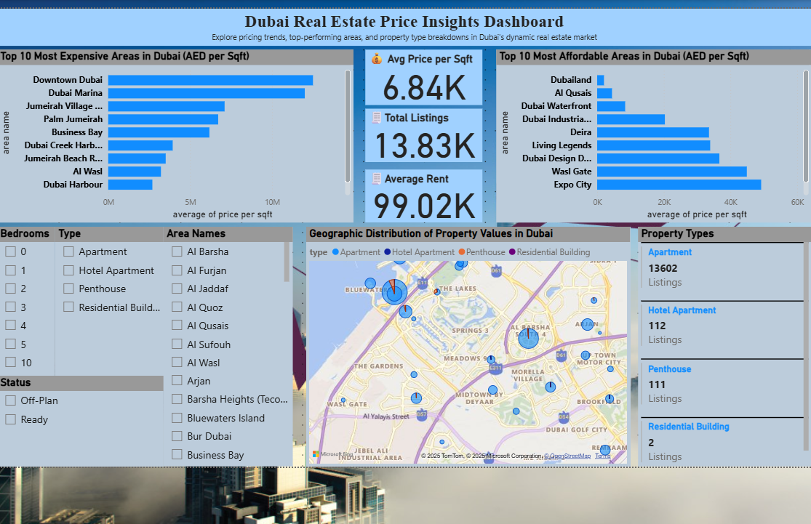

# 🏙️ Dubai Real Estate Data Analysis (2025)

This project analyzes Dubai property sales data using Python and Power BI to uncover trends in pricing, property types, and locations. The final dashboard provides insights to identify the most and least expensive areas, common property types, and average rent metrics across Dubai.

---

## 🔧 Tools & Technologies
- 🐍 Python (Pandas, NumPy, Matplotlib)
- 📊 Power BI (Dashboard & Visualization)
- 📁 Dataset: Dubai Property Sales (Kaggle)
- 📝 Jupyter Notebook (.ipynb)

---

## 📊 Key Insights
- **Most & Least Expensive Areas:** Based on price per square foot.
- **Top Property Types:** Apartments, Villas, and Penthouses by listing count.
- **Interactive Map:** Visualizing property locations using latitude & longitude.
- **KPI Cards:** Showing average rent, total listings, and unique area count.
- **Slicers:** Allowing users to filter by property type and area dynamically.

---

## 🖼️ Dashboard Preview



---

## 📁 Project Structure
```plaintext
Dubai_Real_Estate_DataAnalysis/
├── analysis.ipynb                    # Python-based data analysis
├── Dubai_Property_Sales.csv          # Raw dataset
├── Dubai_Real_Estate_Report.pbix     # Power BI dashboard file
├── Dubai-Dashboard-Screenshot.PNG    # Dashboard screenshot
└── README.md                         # This documentation
